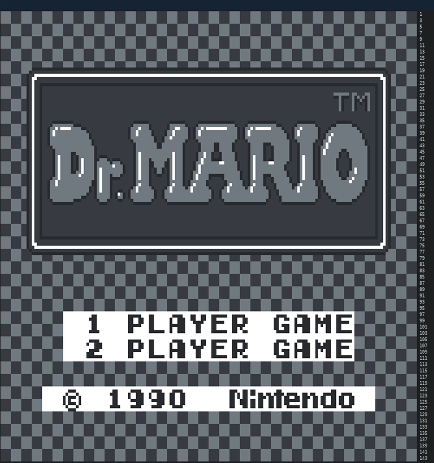

# __GameKun__
### GameKun is an incomplete Game Boy emulator written in elixir.

I wrote GameKun to better learn Elixir and challenge myself by creating an application with many moving parts and lots of state. Ultimately the immutability proved too detrimental to performance and it only ran at ~1fps which is why development was stopped.

If for some reason you want to build the executable, clone the project and run the follow command in the root of the project directory.
```
mix escript.build
```

This will generate an executable file. To run the emulator simply use the following command where `<path_to_rom>` is a path to a `.gb` rom. The height of the game is 72 characters so you many need to reduce your terminal font size to fit more characters vertically. Otherwise scrolling will occur.
```
./gamekun <path_to_rom>
```

Here is an image of the emulator running in my terminal.
Only the background layer is implemented so the menu select icon is not shown. There is also no user input or memory banking so few games will run let alone be playable. The instructions should be nearly all be correct although interrupts are broken. The `cpu_instrs.gb` rom is from Blargg's Test ROMS and is read from by many of the unit tests. Running the test rom itself results in failures followed by a crash.


